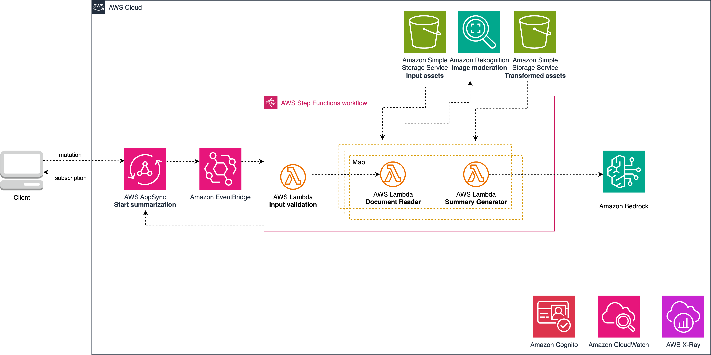

# Image Description

The "Image Description" sample generative AI application showcases the capability of generating descriptive text for images by leveraging the power of AWS services and the AWS Generative AI Cloud Development Kit (CDK) Constructs.

English


Spanish


Multiple Images


## Overview

The sample application features a Streamlit user interface, enabling users to authenticate via Amazon Cognito. Upon successful authentication, users can upload images and leverage the Anthropic Claude 3 foundation model to generate descriptive text for the uploaded images. Behind the scenes, this application utilizes AWS Generative AI CDK constructs, seamlessly integrated with Amazon Bedrock, to access the latest foundation models.

## Architecture



## Folder Structure

This sample application codebase is organized into folders : the backend code lives in ```bin/image-description.ts``` and uses the AWS CDK resources defined in the ```lib``` folder.

The key folders are:

```
samples/image-description
│
├── bin
│   └── image-description.ts                  # CDK app
├── lib                                       # CDK Stacks
│   ├── image-description.ts-stack.ts         # Stack deploying the S3 bucket, Bedrock Agent, Action Group, and Knowledge Base
├── client_app                                # Streamlit  
│   └── pages
        └── image-description.py           
    └── Home.py                               # Streamlit landing 
```

## Getting Started

To deploy this Image description application, follow these steps to set up the required tools and configure your AWS environment:

### Prerequisites

* An AWS account.
* AWS CLI: configure your credentials

aws configure --profile [your-profile]
AWS Access Key ID [None]: xxxxxx
AWS Secret Access Key [None]:yyyyyyyyyy
Default region name [None]: us-east-1
Default output format [None]: json

* Node.js: v18.12.1
* AWS CDK: 2.68.0
* jq: jq-1.6
* Docker - This sample builds a Lambda function from a Docker image, thus you need [Docker desktop](https://www.docker.com/products/docker-desktop/) running on your machine.

### Deploy the solution

This project is built using the [AWS Cloud Development Kit (CDK)](https://aws.amazon.com/cdk/). See [Getting Started With the AWS CDK](https://docs.aws.amazon.com/cdk/v2/guide/getting_started.html) for additional details and prerequisites.

1. Clone this repository.

   ```shell
   git clone <this>
   ```
2. Enter the code sample backend directory.

   ```shell
   cd samples/image-description
   ```
3. Install packages

   ```shell
   npm install
   ```
4. Boostrap AWS CDK resources on the AWS account.

   ```shell
   cdk bootstrap aws://ACCOUNT_ID/REGION
   ```
5. Enable Access to Amazon Bedrock Models

> You must explicitly enable access to models before they can be used with the Amazon Bedrock service. Please follow these steps in the [Amazon Bedrock User Guide](https://docs.aws.amazon.com/bedrock/latest/userguide/model-access.html) to enable access to the models (at minimum, ```Anthropic::Claude```):.

7. Deploy the sample in your account.

   ```shell
   $ cdk deploy --all
   ```
8. Configure client_app

   ```shell
   cd client_app
   python -m venv venv
   source venv/bin/activate
   pip install -r requirements.txt
   ```
9. Still within the /client_app directory, create an ```.env``` file with the following content. Replace the property values with the values retrieved from the stack outputs/console.

```
COGNITO_DOMAIN="<ImageDescStack.CognitoDomain>"
REGION="<ImageDescStack.Region>"
USER_POOL_ID="<ImageDescStack.UserPoolId>"
CLIENT_ID="<ImageDescStack.ClientId>"
CLIENT_SECRET="COGNITO_CLIENT_SECRET"
IDENTITY_POOL_ID="<ImageDescStack.IdentityPoolId>"
APP_URI="http://localhost:8501/"
AUTHENTICATED_ROLE_ARN="<ImageDescStack.AuthenticatedRoleArn>"
GRAPHQL_ENDPOINT = "<ImageDescStack.GraphQLEndpoint>"
S3_INPUT_BUCKET = "<ImageDescStack.InputsAssetsBucket>"
S3_PROCESSED_BUCKET = "<ImageDescStack.processedAssetsBucket>"

```

Note: The ```COGNITO_CLIENT_SECRET``` is a secret value that can be retrieved from the AWS Console. Go to the [Amazon Cognito page](https://console.aws.amazon.com/cognito/home) in the AWS console, then select the created user pool. Under App integration, select App client settings. Then, select Show Details and copy the value of the App client secret.

10. Run client_app
    ```shell
    streamlit run Home.py
    ```

### Test

- Open the browser and go to http://localhost:8501/
- Click login and sign up a user for the first time access.
- Click on Image Description on left panel.
- Upload a file and select preferred configuration on left panel.
- The image along with the generated summary should be displayed on the central panel.

## Clean up

Do not forget to delete the stack to avoid unexpected charges.

First make sure to remove all data from the Amazon Simple Storage Service (Amazon S3) Buckets. Then:

```shell
    $ cdk destroy --all
```

Then in the AWS Console delete the S3 buckets.

## Deployment Options

The `SummarizationAppsyncStepfnProps` interface can be utilized to pass custom properties to the `SummarizationAppsyncStepfn` construct. In the event that no optional properties are provided, the construct will create the resources with their default configurations.

```typescript

// Default summarization construct
//-----------------------------------------------------------------------------
import * as emergingTech from '@cdklabs/generative-ai-cdk-constructs';


const summarization = new emergingTech.SummarizationAppsyncStepfn
    (this, 'ImageSummarization', {
      cognitoUserPool: this.cognitoPool,
      observability: true,
    });

```

# Content Security Legal Disclaimer

The sample code; software libraries; command line tools; proofs of concept; templates; or other related technology (including any of the foregoing that are provided by our personnel) is provided to you as AWS Content under the AWS Customer Agreement, or the relevant written agreement between you and AWS (whichever applies). You should not use this AWS Content in your production accounts, or on production or other critical data. You are responsible for testing, securing, and optimizing the AWS Content, such as sample code, as appropriate for production grade use based on your specific quality control practices and standards. Deploying AWS Content may incur AWS charges for creating or using AWS chargeable resources, such as running Amazon EC2 instances or using Amazon S3 storage.

# Operational Metrics Collection

This solution collects anonymous operational metrics to help AWS improve the quality and features of the solution. Data collection is subject to the AWS Privacy Policy (https://aws.amazon.com/privacy/). To opt out of this feature, simply remove the tag(s) starting with “uksb-” or “SO” from the description(s) in any CloudFormation templates or CDK TemplateOptions.
