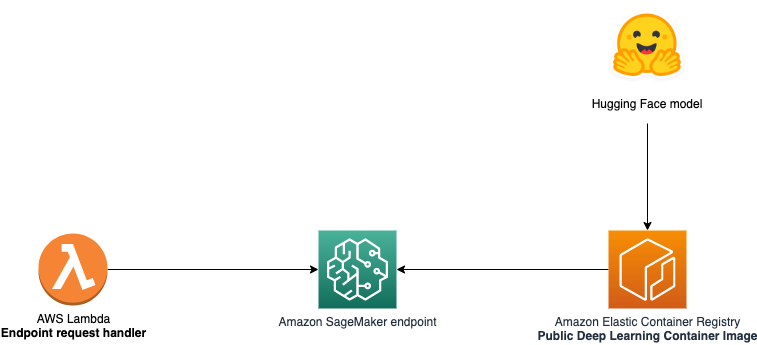

# SageMaker Hugging Face model deployment on AWS Inferentia2

## Overview

The "SageMaker Hugging Face model deployment" sample generative AI application demonstrates how to deploy and interact with a model supported by the [Hugging Face LLM Inference Container for Amazon SageMaker](https://github.com/awslabs/generative-ai-cdk-constructs/blob/main/src/patterns/gen-ai/aws-model-deployment-sagemaker/README_hugging_face.md#:~:text=Models%20supported%20by%20Hugging%20Face%20LLM%20Inference%20Container%20for%20Amazon%20SageMaker) leveraging AWS services and [AWS Generative AI CDK Constructs](https://github.com/awslabs/generative-ai-cdk-constructs).

Specifically, this sample deploys an AWS Lambda function which interacts with a SageMaker real-time endpoint, hosting [aws-neuron/zephyr-7b-seqlen-2048-bs-4-cores-2](https://huggingface.co/aws-neuron/zephyr-7b-seqlen-2048-bs-4-cores-2) from Hugging Face on [AWS Inferentia2](https://aws.amazon.com/ec2/instance-types/inf2/). This is possible thanks to the release of [Hugging Face Text Generation Inference for AWS Inferentia2](https://huggingface.co/blog/text-generation-inference-on-inferentia2). The previous blog post provides detailed information on the compatible models with this new release.

By providing reusable constructs following AWS best practices, this app helps you quickly build custom generative AI apps on AWS.

Here is the architecture diagram of the sample application:



## Folder Structure

This sample application codebase is organized into folders : the backend code lives in ```bin/sagemaker_huggingface_inferentia.ts``` and uses the AWS CDK resources defined in the ```lib``` folder.

The key folders are:

```
samples/sagemaker_huggingface_inferentia
│
├── bin
│   └── sagemaker_huggingface_inferentia.ts             # Backend - CDK app
├── lib                                                 # CDK Stacks
│   ├── sagemaker_huggingface_inferentia-stack.ts       # Stack deploying the AWS Lambda function and SageMaker real-time endpoint
```

## Getting started

> **Warning**
> This sample allows you to interact with models from third party providers. Your use of the third-party generative AI (GAI) models is governed by the terms provided to you by the third-party GAI model providers when you acquired your license to use them (for example, their terms of service, license agreement, acceptable use policy, and privacy policy).

> You are responsible for ensuring that your use of the third-party GAI models comply with the terms governing them, and any laws, rules, regulations, policies, or standards that apply to you.

> You are also responsible for making your own independent assessment of the third-party GAI models that you use, including their outputs and how third-party GAI model providers use any data that might be transmitted to them based on your deployment configuration. AWS does not make any representations, warranties, or guarantees regarding the third-party GAI models, which are “Third-Party Content” under your agreement with AWS. This sample is offered to you as “AWS Content” under your agreement with AWS.

To deploy this sample application, follow these steps to set up the required tools and configure your AWS environment:

### Prerequisites

- An AWS account. We recommend you deploy this solution in a new account.
- [AWS CLI](https://aws.amazon.com/cli/): configure your credentials

```
aws configure --profile [your-profile] 
AWS Access Key ID [None]: xxxxxx
AWS Secret Access Key [None]:yyyyyyyyyy
Default region name [None]: us-east-1 
Default output format [None]: json
```

- Node.js: v18.12.1
- [AWS CDK](https://github.com/aws/aws-cdk/releases/tag/v2.116.0): 2.116.0
- jq: jq-1.6
- Make sure you have sufficient quota for the instance type implemented in this sample (service Amazon SageMaker, instance type `ml_inf2_8xlarge` for endpoint usage). For more information, refer to [AWS service quotas](https://docs.aws.amazon.com/general/latest/gr/aws_service_limits.html).

### Deploy the solution

This project is built using the [AWS Cloud Development Kit (CDK)](https://aws.amazon.com/cdk/). See [Getting Started With the AWS CDK](https://docs.aws.amazon.com/cdk/v2/guide/getting_started.html) for additional details and prerequisites.

1. Clone this repository.
    ```shell
    git clone https://github.com/aws-samples/generative-ai-cdk-constructs-samples.git
    ```

2. Enter the code sample backend directory.
    ```shell
    cd samples/sagemaker_huggingface_inferentia
    ```

3. Boostrap AWS CDK resources on the AWS account.
    ```shell
    cdk bootstrap aws://ACCOUNT_ID/REGION
    ```

6. Deploy the sample in your account. 
    ```shell
    $ cdk deploy
    ```

The command above will deploy one stack in your account. With the default configuration of this sample, the observed deployment time was ~371 seconds (6 minutes).

To protect you against unintended changes that affect your security posture, the AWS CDK Toolkit prompts you to approve security-related changes before deploying them. You will need to answer yes to get all the stack deployed.

### Test

- In the AWS console, navigate to [AWS Lambda](https://us-east-1.console.aws.amazon.com/lambda/home?region=us-east-1#/functions?sb=lastModified&so=DESCENDING) and select the function named ```testzephyrhuggingfaceinferentia```

- Under the Code tab, click ```Test```. This will send a request to the SageMaker endpoint, and display the result. 

- You can update the parameters and prompt sent to the endpoint in the ```dic``` (file lambda.py) structure.

## Clean up

Do not forget to delete the stack to avoid unexpected charges.

```shell
    $ cdk destroy
```

Delete all the associated logs created by the different services in Amazon CloudWatch logs

# Content Security Legal Disclaimer
The sample code; software libraries; command line tools; proofs of concept; templates; or other related technology (including any of the foregoing that are provided by our personnel) is provided to you as AWS Content under the AWS Customer Agreement, or the relevant written agreement between you and AWS (whichever applies). You should not use this AWS Content in your production accounts, or on production or other critical data. You are responsible for testing, securing, and optimizing the AWS Content, such as sample code, as appropriate for production grade use based on your specific quality control practices and standards. Deploying AWS Content may incur AWS charges for creating or using AWS chargeable resources, such as running Amazon EC2 instances or using Amazon S3 storage.

# Operational Metrics Collection
This solution collects anonymous operational metrics to help AWS improve the quality and features of the solution. Data collection is subject to the AWS Privacy Policy (https://aws.amazon.com/privacy/). To opt out of this feature, simply remove the tag(s) starting with “uksb-” or “SO” from the description(s) in any CloudFormation templates or CDK TemplateOptions.
